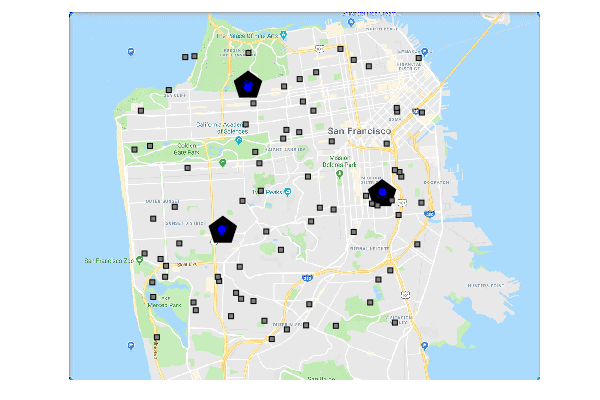

# MultiAgentAllocationTransit

Accompanying code repository for our ICRA 2020 submission 'Efficient Multi-Drone Delivery Using Transit Networks' ([ArXiv]()).
In this paper, we present a comprehensive algorithmic framework to operate a large fleet of drones to deliver
packages in an urban area while using transit networks to enhance their effective range. Please see the extended
version on ArXiv for the formulation, algorithms, experiments, and discussions.

### Illustrations

Below is a visualized scenario with 80 agents in San Francisco,
using the bus network and other parameters as described in the paper.
The black pentagons are depots, the grey rectangles are delivery
locations, blue circles are drones flying, and red circles are drones riding on transit. We
do not render the actual transit vehicles (buses) for clarity. Multiple drones may use a transit option
simultaneously; we can only render one red circle in that case.
_Locations are randomly generated within a bounding
box, and some of them may be slightly offshore_.

Here is another example, with 110 agents, in the Washington DC Metropolitan Area:

